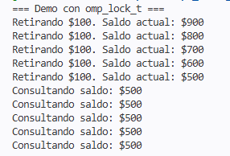
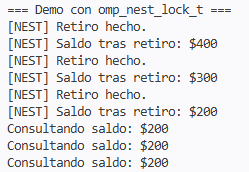

# Expo_edaII_ Locks explícitos
Alumnos
- 322112364 - Cordova Villar Mario Alberto
- 322048399 - Morales Garcia Erendira Sophia
- 321206954 - Jonathan Emanuel Aguilar Campos
## Introducciòn
<!--7. Sistemas de archivos y almacenamiento
Bloquean archivos o segmentos mientras son escritos para evitar que otro proceso lea datos incompletos o inconsistentes.-->
##  Contexto y teoria
https://claude.ai/share/93749c9f-ddb1-4b70-be9b-0edcb3669374 
<!--Tipos: omp_lock_t, omp_nest_lock_t.
La API básica (omp_init_lock, omp_set_lock, omp_unset_lock, omp_destroy_lock).
Cuándo critical global se queda corto y se necesitan locks independientes.
Diferencia entre omp_lock_t y omp_nest_lock_t (riesgo de deadlock al reentrar).-->
### ¿Por qué no usar critical?

  Critical tiene un poder increible al momento de generar un bloque de código que sea estatico y mantenga a raya los hilos, pero tiene dos grandes defectos que arruinan esta magia por completo:
  
  ### Muy estricto:
  Uno de los problemas que tenemos al momento de generar un bloque critical es que estamos condicionados a que todo se tenga   que trabajar en un mismo lugar, es decir, no podemos tener dos secciones CRITICAL simultaneas (Lo vuelve ineficiente en      trabajos grandes), y al estar condicionado a un bloque entre llaves {....} estrictamente, impidiendo tratar de manera        flexible el programa
      
  ### Problema de recursividad:
  Si existe una función recursiva y dentro de ella tiene un bloque critical, entrara por primera vez de manera adecuada, sin   embargo, al moment0 de querer realizar la segunda iteracion, el hilo volvera a tratar de entrar al bloque critical, al       estar ya ocupadon (por si mismo), el programa muere en un deadlock.
      
### API 
  ### omp_init_lock_ y omp_init_nest_lock (inicialización):

  Esta función marca el inicio del candado, construyen la estrucutura de omp (prepara el espacio en memoria RAM).

  en omp_init_lock, Toma el espacio de memoria apuntado por lock (que antes tenía basura), limpia los residuos de datos y      establece su estado interno como 0 (Desbloqueado/Libre). También inicializa una cola de hilos (wait queue) inicialmente      vacía. Si un hilo intenta usar el candado antes de esta función, el programa lanzará un error de segmentación                (Segmentation Fault) porque la dirección de memoria apunta a datos corruptos.

  en omp_init_nest_lock, se sigue la misma lógica anterior, añadiendo 2 caracteristicas primordiales:
    -El identificador del hilo dueño se establece en un valor nulo/vacío.
    -El contador de anidamiento se establece explícitamente en 0.

  ### omp_set_lock_ y omp_set_nest_lock

  Tanto en omp_set_lock_ y omp_set_nest_lock se realiza una inspección del candado, si este esta desbloqueado (0), lo cambia   automaticamente a ocupado (1), y continua con el proceso de forma normal (cambia a un estado de suspended-bloqued).

  Sin embargo omp_set_nest_lock tiene diferencias, al momento de la validación del candado, estas son.

  1. Si el candado está libre (Contador = 0): El hilo toma el candado, el sistema registra su ID de hilo como "Dueño" y el        contador sube a 1.

  2. Si el candado está ocupado, pero el dueño es EL MISMO hilo: OpenMP lo deja pasar sin detenerlo e incrementa el contador     interno (contador++).

  3. Si el candado está ocupado por OTRO hilo: El hilo actual se congela en la cola de espera exactamente igual que en el         candado simple.

### omp_lock_t

  
### omp_nest_lock_t
### Diferencias
|caracteristica|omp_lock_t|omp_nest_lock_t|
| ------------ | --------- | --------------|
|carac 1 | h | j| 
## 🔗 Presentación:
https://canva.link/0b1230f7sty6oc0
## Resultados
<!--profundizar mas en esta parte-->

El uso de omp_lock_t y omp_nest_lock_t demostró ser crucial para evitar condiciones de carrera y proteger los datos compartidos. Mientras que omp_lock_t controló con éxito las operaciones de saldo mediante exclusión mutua estricta, omp_nest_lock_t resolvió el problema de las llamadas anidadas, permitiendo que un hilo reingrese al mismo candado sin bloquearse a sí mismo. Gracias a estas herramientas, el saldo final de la cuenta permaneció intacto y sin errores, lo que evidencia que una sincronización adecuada es indispensable al programar en paralelo.

## Conclusiones 
<!--cuándo conviene usarlo, para que es mas util, y en que cosas no es tan eficiente-->

## Referencias
